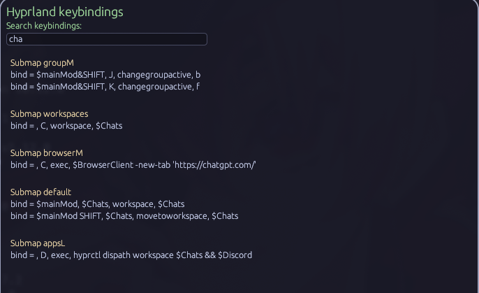

# HyprKeys

This program is an utility that scans dotfiles for 
hyprland and creates a allow to find the keybindings.
This was the first project in rust and the idea was to learn
the basis of GUI in rust. It can only agroup keybings that uses
binds written like this "bind = " (including spaces).



## Dependencies
eframe

walkdir

## How to use
```zsh
cargo run
```
