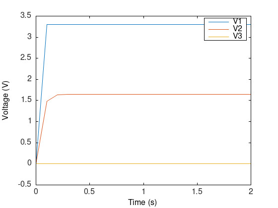

# circuitx

An extremely simple circuit simulator that performs 
DC trascient analysis using MNA (Modified Nodal Analysis).
It can only simulate simple components:

DC voltage source.
Resistor.
Inductor.
Capacitor.

It uses a netlist based in a json file.
The test example shows the structure and
fields required in the json file.
The output is shows in a png.

## requirements:
matplotplusplus

nlohmann/json

argparse

## How to use
To build the project
```zsh
mkdir build
cmake -S . -B build
cmake --build build

```

To execute the project run the next command

```zsh
./build/circuitx "./test/netlist.json"
```

This simulates this circuit:
```bash
v1 0 1 3.3V
r1 1 2 10K
r2 2 3 10K
c1 2 0 0.22uF
l1 3 0 0.1nH
```




