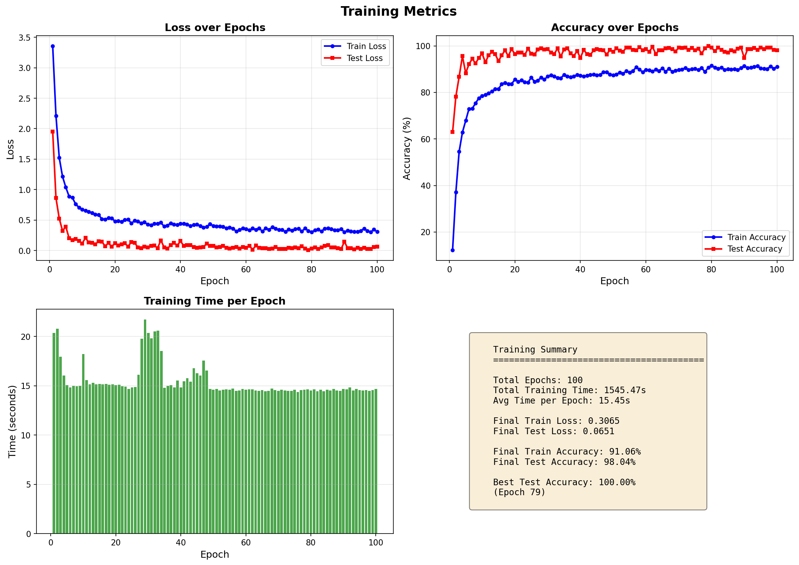
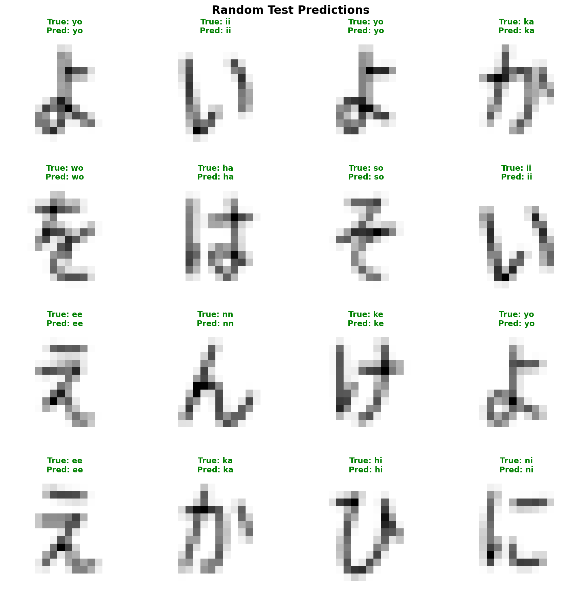

# Hiragana classifier

Another very simple classifier. 
This is a hiragana (japanese basic silabary) classifier
coded in pythpn + pytorch. 






# Dependencies
Dataset: https://www.kaggle.com/datasets/farukece/handwritten-japanese-hiragana-characters <br>

pytorch <br>
customtkinter <br>
matplotlib <br>
argparse <br>
scikit-learn <br>

# How to use
You can use to run a window to draw a run predictions (at the moment only a CNN model is supported).
```zsh
python main.py gui
```

There are other commands you can see in main file or running:
```zsh
python main.py --help
```

