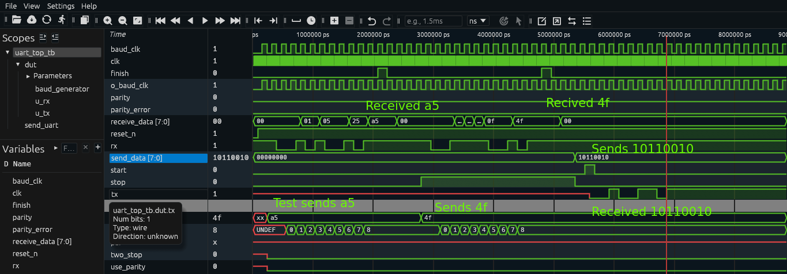
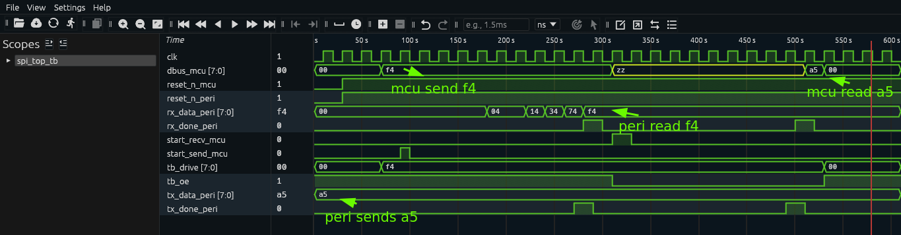

# serialprotocols

In this project I attempted to design hardware to run UART, SPI and I2C serial communication protocols.
To be honest I2C becomes somehow difficult and at the end I did not do it. 

The code was written in System Verilog and it is supposed to synthetisable, but since
I don't own a FPGA I am not totally sure if it actually is or it is not.

## Test for UART

[TEST 1] receive_data=0xa5  finish=1  parity_error=0  (expect A5, 1, 0)
[TEST 2] receive_data=0x4f  finish=1  parity_error=0  (expect 4F, 1, 0)
[TEST 3] TX frame for 0xB2 completed, tx=1 (expected 1)

## Test for PSI

TEST 1 PASS: peripheral got 0xf4 = 0x11110100
TEST 2 PASS: controller read 0xa5

