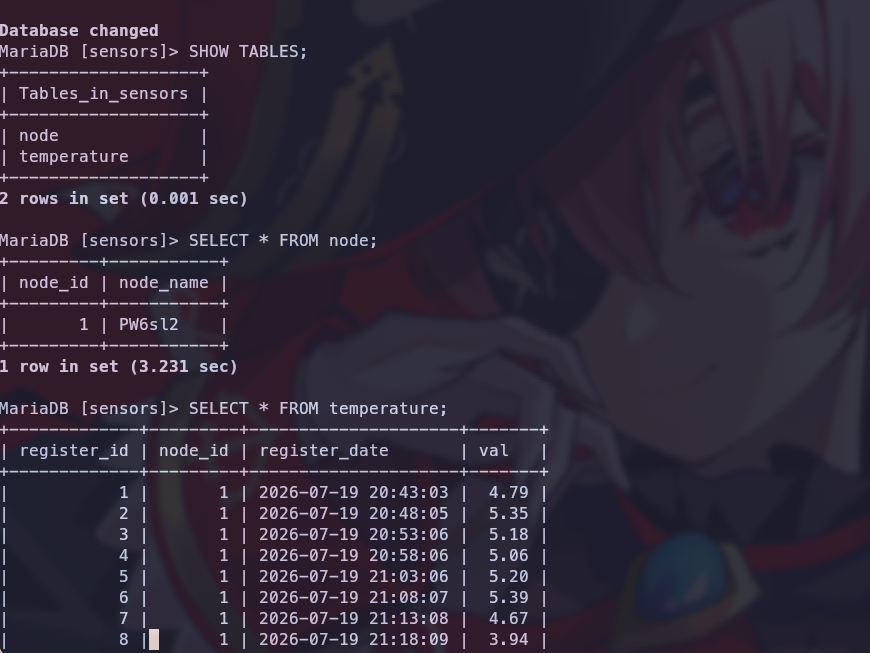

# sql_sensors

A python project to start a SQL database using mysql (mariadb)
and a tcp server.

Then a tcp cliente running in a raspberry pi pico w 
sends data to the tcp server to insert data from sensors
in the database.

It uses a very simple protocol. At boot time (first run)
of tcp cliente it sends a request to the server to register the device
in the database as new device. Then the server returns a unique identifier (an int)
that is stored in the device filesystem. On posterior use of the device,
it ask first if it has the unique identifier, and the starts sending data 
to the server using the unique identifier and sensors data.

## dependencies
micropython  
mysql  
tabular  

Raspberry pi pico and NTC thermistors.  

