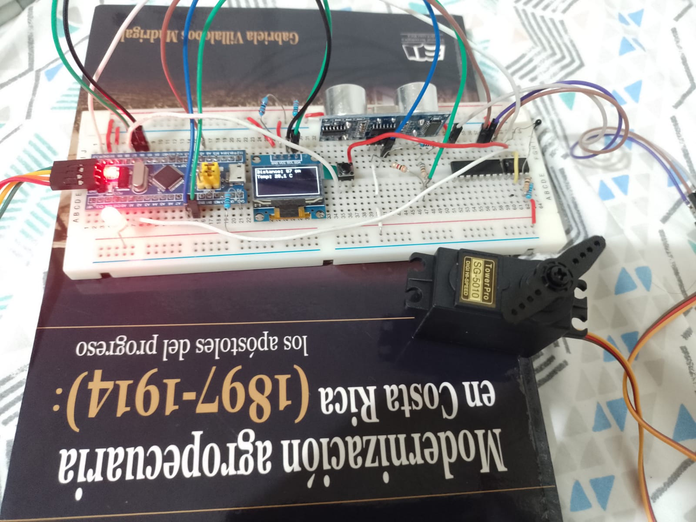

# stm32multidevice

https://github.com/user-attachments/assets/d35640fc-b94d-440d-af18-d244fd55ea62

A bunch of controls for multiple devices connected to the same
STM32F103COT6 microcontroller. All task for each device run in parallel
using an scheduler without RTOS. This is faster and use less resources,
but program size become larger.

Devices connected: <br>
SG-510 servomotor <br>
SSD1306 I2C OLED Display <br>
Thermistor NTC 5kOhm <br>
HC-SR04 Ultrasonic distance sensor <br>
Led <br>
Button <br>

The idea of this mini project is to test rust capabilities in IoT
and parallel program execution without RTOS.



## Dependecies

cortex-m  <br>
cortex-m-rt <br>
embassy-stm32  <br>
embassy-executor  <br>
embassy-time  <br>
embassy-sync  <br>
embassy-futures <br>
embedded-graphics  <br>
ssd1306  <br>
heapless  <br>
deffmt  <br>
deffmt-m-rt <br>
libm  <br>
panic-halt <br>
panic-probe <br>
static-cell  <br>

## How to use
Connect your programmer to MCU and run the next command in root directory.

```zsh
cargo run

```

