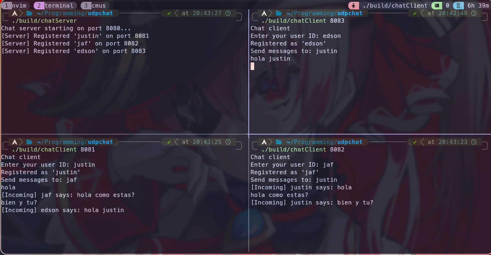

# udpChat



This is an example of UDP for a chatting app.
While UDP is not intended for this kind of application,
since it is a connectionless communication protocol,
it is still usefull to know its limitation and characteristics.

This projects has two version. 

## 1. P2P
In the P2P (pear-to-pear) version each client talk to other client directry
without an intermediate server. This is better for data privacy and 
also is faster since server do not act as a bottleneck in massive communication.
Also it reduces change of data corruption while server process a request,
which will be frequent due to UDP nature.

The main drawback, in this version, is that user must to know somehow IP address
of other client it wants to communicate to.

## 2. Client-Server-Client
In the second version, server holds register of (user ID, ip) address,
so that clients only needs to know user ID. Server
receive a message from a client asking for a transmision to a other client
and server fordward it. 

In both cases, since these are demos, instead of IP address I just care of port
and everything is forwarded to localhost 127.0.0.1, so that each client
is in the form 127.0.0.1:port

To run the programs use this:

```zsh
mkdir build
cmake -S . -B build
cmake --build build

#p2p version (first port is who you are, the second one is who you want to talk to)
./build/udpChat 8080 8081
./build/udpChat 8081 8080 
#...

#csc version
./build/chatServer
./build/chatClient 8081 # port is who you are, then into app you register your id and id of who want to talk to
./build/chatClient 8082
#...
```


