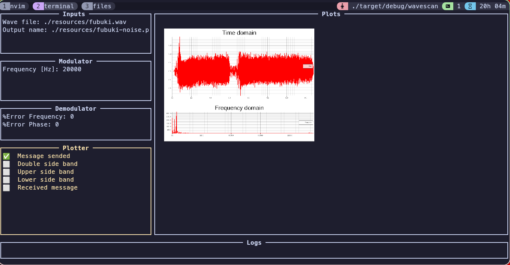

# wavescan
An simple waveform analyzer. It just plot 
time domain signal of wave file and its frecuency domain representation
in an image.

It also performs a simulation of AM Single side band modulation with some
adjustable parameters.

My interest of this simple program is to understand 
clap (an argument parse library), plotters (an graph drawer library)
and ratatui (a terminal user interface library).

## Dependecies
wavers

plotters

rustfft

clap

ratatui

ratatui-image

tui-checkbox

## How to use
Run the following commands. The output will be in an png in resources folder.
You can also specify an file output adding the command --output

```zsh
cargo build

./target/debug/wavescan --input ./resources/fubuki.wav
```


